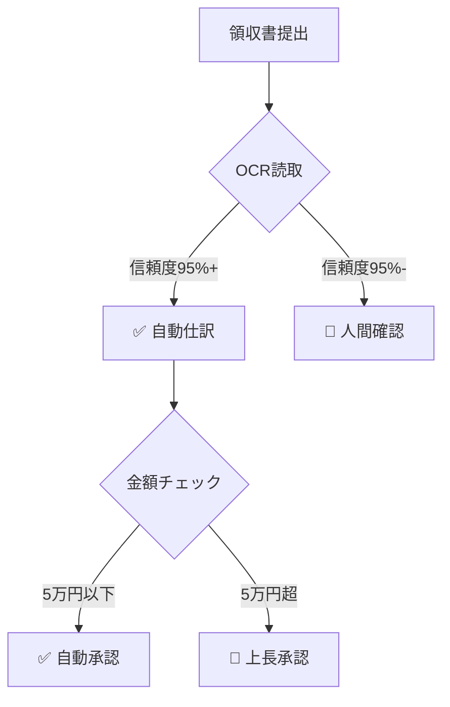
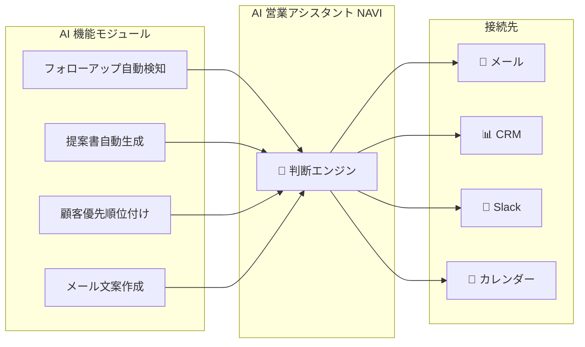

# Nebula Infinity Instant MVP（AI 解決方案シミュレーター）

> 来源：Z + Gemini + OC_ZG 讨論，2026-02-12 ~ 02-13
> 状态：**Draft V4** — Agent 驱动架构确定，待技术验证
> 启发：某网站 "3分で開発見積り" 功能

---

## 一、核心概念

### 1. 产品定义

- **名称**: Nebula Infinity Instant MVP (或 AI Solution Simulator)
- **定位**: 面向非技术背景的企业决策者，提供"从业务痛点到数字化原型"的即时体验
- **核心差异化**:
  - 不是生成代码 → 而是生成**"业务解决方案"**
  - 不是聊天机器人 → 而是生成**"可交互的 App 界面"**
  - 不是玩具 → 而是**"销售线索の強力な武器"**，直接导出为开发提案

### 2. 用户体验流程 (User Flow)

"咨询顾问化"的流程，而非"程序员化"的流程。

1. **場景選択 (Context)**: 选择服务类型（AI 自動化 / AI アプリ / AI エージェント）
   - 锁定方向 → 选择对应 UI 模板 + 场景子类型

2. **痛点診断 (Consulting)**: 回答 3 个非技术问题
   - 模拟咨询师问诊，提取核心需求
   - ⚠️ 问题设计原则：**逆向推導** — 从我们能提供的能力出发，问出恰好够驱动 Agent 的信息

3. **AI 生成 (Building)**:
   - 后端：mvp-builder 根据回答动态生成 Session Prompt
   - 前端：选择对应 UI 模板 + 注入配置参数
   - 界面展示："業務ロジックを分析中..." → "AIアシスタントを構築中..." → "完成！"

4. **体験交付 (Delivery)**:
   - **主界面**: 场景对应的 UI 模板（流程图/App 画面/Chat Timeline）
   - **AI 対話**: 真实的 Agent 在背后驱动，不是 Mock
   - **診断レポート**: 三层方案（A/B/C）+ KPI 试算 + 导入路径

5. **転化 (Action)**: "ご予約いただくと、このAIをベースに実際のシステムを構築します"

---

## 二、架构演进

### V1（废弃）：全模板方案
- 为每个行业预制完整 Next.js 项目 + Cloudflare Tunnel 暴露
- ❌ 模板维护成本爆炸，Mock 数据假，Agent 场景无法表达

### V2（废弃）：模板 + AI 填充
- 预制模板 + AI 填充公司名/数据/模块开关
- ❌ AI 部分仍是 Mock，核心问题未解决

### V3（中间方案）：纯 Agent
- 完全用 Agent 对话替代模板
- ❌ 自動化缺流程图，AI App 缺完整界面

### V4（当前）：Agent + UI 模板 混合架构 ✅
- **Agent 是大脑**：真实 AI 对话、分析、决策
- **UI 模板是身体**：场景化的可视界面，渲染 Agent 的输出
- **最佳组合**：Agent 的智能 + 模板的视觉冲击

---

## 三、技术架构（V4）

### 核心设计

```
单一预设 Agent (mvp-demo)
├─ model: claude-sonnet-4-5（成本可控）
├─ tools: deny ALL（只有对话能力，零工具）
├─ sandbox: all + session scope（每 demo 独立容器）
└─ 多 Session 并行
    ├─ session demo-{uuid-1} ← 経費精算 prompt
    ├─ session demo-{uuid-2} ← 契約書分析 prompt
    └─ session demo-{uuid-3} ← 営業アシスタント prompt
```

**不需要重启 Gateway。** 新 Session 只是新对话，Agent 配置不变。

### 系统架构

```
┌─────────────────────────────────────────────────┐
│  客户浏览器                                       │
│  nebulainfinity.com/instant-mvp                  │
│                                                   │
│  [服务选択] → [3つの質問] → [生成アニメ] → [体験]  │
│                                                   │
│  体験画面:                                        │
│  ┌──────────────────────────────────────────────┐│
│  │                                              ││
│  │  場景対応 UI テンプレート                      ││
│  │  (流程図 / App 画面 / Chat Timeline)          ││
│  │                                              ││
│  │  ← Agent の出力をリアルタイム渲染 →            ││
│  │                                              ││
│  ├──────────────────────────────────────────────┤│
│  │  💬 AI との対話エリア                          ││
│  │  + 📊 診断レポートパネル                       ││
│  └──────────────────────────────────────────────┘│
│  [プランA] [プランB] [プランC ★推奨]              │
└─────────────────────────────────────────────────┘
          │ Quiz 提出
          ▼
┌─────────────────────────────────────────────────┐
│  主站 API (Cloudflare Worker)                    │
│  → 验证 + Rate Limit (每 IP 每日 3 次)           │
│  → Quiz 回答 → Session Prompt 生成               │
│  → 创建 mvp-demo 新 Session                      │
│  → 返回 session ID + UI 模板类型                  │
└─────────────────────────────────────────────────┘
          │
          ▼
┌─────────────────────────────────────────────────┐
│  OpenClaw mvp-demo Agent                         │
│                                                   │
│  Session: demo-{uuid}                            │
│  System Prompt: 动态生成（基于 Quiz 回答）         │
│  Tools: NONE（纯对话）                            │
│  Sandbox: Docker 隔离                             │
│  Limit: 50 msg / 24h TTL                         │
└─────────────────────────────────────────────────┘
```

### Agent 安全配置（OpenClaw）

```jsonc
// openclaw.json 中的 mvp-demo agent 定义
{
  "id": "mvp-demo",
  "name": "MVP Demo",
  "model": "anthropic/claude-sonnet-4-5",
  "workspace": "/root/.openclaw/agents/mvp-demo/workspace/",
  "agentDir": "/root/.openclaw/agents/mvp-demo/agent/",
  "identity": { "name": "Nebula AI", "emoji": "🌟" },
  "sandbox": {
    "mode": "all",              // 所有 session 进 Docker
    "scope": "session",         // 每个 demo 独立容器
    "workspaceAccess": "none"   // 看不到任何文件
  },
  "tools": {
    "deny": ["group:openclaw"]  // 禁止所有内置工具（只有对话）
  },
  "subagents": {
    "allowAgents": []           // 不能 spawn/send 任何 agent
  }
}
```

**安全效果：**
- ❌ 无法执行任何 shell 命令 (exec/bash/process)
- ❌ 无法读写任何文件 (read/write/edit)
- ❌ 无法查看/操作其他 session (sessions_*)
- ❌ 无法修改系统配置 (gateway/cron)
- ❌ 无法发送外部消息 (message)
- ❌ 无法操作浏览器 (browser/canvas)
- ❌ 无法访问设备 (nodes)
- ✅ 只能对话 — 纯粹的语言模型能力

**OpenClaw 工具限制文档来源：**
- `docs/gateway/sandbox-vs-tool-policy-vs-elevated.md`
- `docs/multi-agent-sandbox-tools.md`
- `docs/tools/index.md`
- 支持: `tools.deny` (blacklist), `tools.allow` (whitelist), `tools.profile` (preset)
- Tool Groups: `group:runtime`, `group:fs`, `group:sessions`, `group:memory`,
  `group:web`, `group:ui`, `group:automation`, `group:messaging`, `group:nodes`
- `group:openclaw` = 所有内置工具

### 安全控制汇总

| 控制层 | 机制 | 说明 |
|--------|------|------|
| **工具限制** | `tools.deny: ["group:openclaw"]` | Agent 无任何工具，只能对话 |
| **Docker 隔离** | `sandbox.mode: "all"`, `scope: "session"` | 每个 demo 独立容器 |
| **文件隔离** | `workspaceAccess: "none"` | 看不到 Agent workspace |
| **Session 隔离** | OpenClaw 内置 | 各 session 对话历史互相不可见 |
| **Agent 隔离** | `subagents.allowAgents: []` | 无法接触其他 agent |
| **消息数限制** | API 层实装 | 每 session 50 条上限 |
| **TTL** | API 层 + cron 清理 | 24h 自动归档 |
| **生成频率** | Cloudflare Worker Rate Limit | 每 IP 每日 3 次 |
| **Prompt 注入** | System Prompt 防御指示 + 输入过滤 | 多层防护 |
| **数据免责** | UI 明示 | 「機密情報の入力はお控えください」 |

---

## 四、三層方案設計（松竹梅モデル）

每个场景的诊断报告给出 **3 个 AI 融合程度不同的方案**，
利用日本企业文化中的"松竹梅"心理 + 段階導入偏好：

| プラン | AI 融合度 | 特徴 | 心理定位 |
|--------|-----------|------|----------|
| **プラン A: フル自動化** | 95% | 最大効率、人手ほぼ不要 | 松（最高）— 让客户看到"未来感" |
| **プラン B: ヒューマン・イン・ザ・ループ** | 40% | 人間が最終判断、AI はサポート | 梅（最低）— 安心感の提供 |
| **プラン C: ハイブリッド（推奨）** | 75% | AI 主導 + 重要ポイントで人間確認 | 竹（推奨）— 最も選ばれやすい |

### 実装方式

- UI 模板的 **Tab/按钮切替**（プラン A / B / C）
- 切替时 Agent 收到 `/plan-a` `/plan-b` `/plan-c` 指令，改变回答风格
- 自動化場景：流程图中 AI/人工步骤比例变化
- AI App 場景：功能面板の開/關変化
- Agent 場景：自律度変化（全自動 / 提案のみ / ハイブリッド）

### 诊断报告中的表达

报告用"咨询顾问"口吻，针对每个方案给出：
- **期待効果**（定量 KPI）
- **導入リスク**（AI 精度依存、学習コスト等）
- **推奨理由**（为什么 C 最适合大多数企業）
- **段階移行パス**（B → C → A 的升级路径）

---

## 五、三大場景設計

### 場景分類

| 場景 | 核心价值 | 主界面 | Chat 角色 | UI 模板 |
|------|----------|--------|-----------|---------|
| **AI 自動化** | 既存フロー効率化 | 流程図 + KPI | 主要交互手段 | Chat + Mermaid + KPI Cards |
| **AI アプリ** | AI 新機能の導入 | App 画面 | 辅助（質問用） | App UI（交互由客户定义） |
| **AI エージェント** | 自律的な業務代行 | Chat Timeline | 主要交互手段 | Chat + Timeline + 承認按钮 |

---

### 場景 1: AI 自動化（経費精算の例）

**特徴：Chat が主界面 + 流程図を可視化**

Agent は「業務コンサルタント」として対話し、回答に **Mermaid フローチャート** と **KPI データ** を埋め込む。UI テンプレートがリアルタイムで渲染する。

#### Quiz 設計

| # | 質問 | 逆向推導の意図 |
|---|------|---------------|
| Q1 | 月に何件くらいの処理がありますか？ | → KPI の基数 |
| Q2 | 一番手間がかかっている作業は？（選択肢） | → テンプレート重点モジュール |
| Q3 | 現在の処理にどれくらい時間がかかっていますか？ | → Before/After 比較基準 |

#### Agent 出力フォーマット

Agent は Markdown で回答。UI テンプレートが以下を検出して渲染：

**① Mermaid コードブロック → 流程図**



**② KPI JSON ブロック → 数値カード**

```json:kpi
{
  "before": { "timePerItem": "15分", "monthlyHours": 75 },
  "after":  { "timePerItem": "3分",  "monthlyHours": 15 },
  "reduction": "80%",
  "annualSaving": "¥4,320,000"
}
```

**③ プラン切替時：** `/plan-a` → Agent が異なる Mermaid（全自動フロー）を出力

#### UI テンプレート構成

```
┌───────────────────────────────────────────┐
│ 🏭 経費精算 AI 自動化デモ                    │
│                                           │
│ ┌─────────────┐  ┌──────────────────────┐│
│ │ 📊 KPI       │  │  フローチャート        ││
│ │ Before→After │  │  (Mermaid 渲染)       ││
│ │ 80% 削減     │  │                      ││
│ └─────────────┘  └──────────────────────┘│
│                                           │
│ ┌───────────────────────────────────────┐ │
│ │ 💬 AI コンサルタントとの対話             │ │
│ │ > 御社の場合、3つの自動化ポイントが...   │ │
│ └───────────────────────────────────────┘ │
│ [プランA] [プランB] [プランC ★]            │
└───────────────────────────────────────────┘
```

#### サンプル対話

```
🤖: はじめまして！経費精算AIアドバイザーです。
   月間300件の処理、領収書確認がボトルネックですね。
   
   現在のフローを可視化しました 👆
   
   3つの自動化ポイントを提案します：
   ① OCR 自動読取（15分→30秒）
   ② AI 自動仕訳（信頼度ベース）
   ③ ルールベース自動承認（金額閾値）
   
   プランCの場合の試算：
   → 処理時間 80% 削減、年間 ¥432万 節約
   
   詳しく聞きたいポイントはありますか？

👤: 承認フローの自動化をもっと詳しく

🤖: 承認フローの自動化、詳細をお見せします。
   [更新された Mermaid + KPI が UI に渲染される]
```

---

### 場景 2: AI アプリケーション（契約書分析の例）

**特徴：App UI が主界面、Chat は辅助。交互規則は客户の Quiz 回答で決定。**

Agent は App の「バックエンド頭脳」として構造化データを返す。
UI テンプレートが完全な App 画面を渲染。**客户は画面上で操作し、必要に応じて Chat で質問する。**

#### Quiz 設計

| # | 質問 | 逆向推導の意図 |
|---|------|---------------|
| Q1 | どんな種類の文書を扱いますか？（選択肢） | → サブテンプレート選択 + mock サンプル |
| Q2 | その文書で一番困っていることは？（選択肢） | → 表示パネルの優先順位 |
| Q3 | 現在、文書関連の作業に週何時間くらい使っていますか？ | → KPI ベースライン |

#### Agent 出力フォーマット

AI App 場景では、Agent の回答は **構造化 JSON** が中心。
UI テンプレートが JSON を解析し、App 画面の各パネルに反映：

```json:analysis
{
  "document": {
    "title": "秘密保持契約書",
    "type": "NDA",
    "pages": 5
  },
  "clauses": [
    {
      "id": 1,
      "title": "秘密保持義務",
      "text": "甲および乙は...",
      "risk": "low",
      "tags": ["双方向", "例外あり"]
    },
    {
      "id": 2,
      "title": "損害賠償",
      "text": "乙は甲に対し...",
      "risk": "high",
      "tags": ["片務的", "上限なし"],
      "warning": "損害賠償に上限がありません。交渉をお勧めします。"
    }
  ],
  "overallScore": 65,
  "suggestions": [
    "第2条の損害賠償に上限（契約金額の2倍等）を設定",
    "秘密保持の存続期間（3年等）を明記"
  ]
}
```

```json:conversational
{
  "message": "分析が完了しました。全体スコアは65点（注意レベル）です。第2条に高リスク条項を検出しました。詳細をご確認ください。"
}
```

#### UI テンプレート構成

```
┌────────────────────────────────────────────┐
│ 📄 AI 契約書分析ツール デモ                   │
│                                            │
│ ┌────────────────┐ ┌────────────────────┐  │
│ │ 文書ビューア     │ │ AI 分析パネル       │  │
│ │                │ │                    │  │
│ │ 第1条 秘密保持  │ │ ■ 条項分類          │  │
│ │ [🟢 低リスク]   │ │   秘密保持 🟢       │  │
│ │                │ │   損害賠償 🔴       │  │
│ │ 第2条 損害賠償  │ │                    │  │
│ │ [🔴 高リスク]   │ │ ■ 全体スコア: 65    │  │
│ │  ⚠ 上限なし    │ │ ■ 修正提案 2件      │  │
│ │                │ │                    │  │
│ │ [サンプルで試す] │ │ [修正案を見る]      │  │
│ └────────────────┘ └────────────────────┘  │
│                                            │
│ ┌────────────────────────────────────────┐  │
│ │ 💬 AI に質問する                        │  │
│ │ > 第2条のリスクについて詳しく教えて      │  │
│ └────────────────────────────────────────┘  │
│ [プランA] [プランB] [プランC ★]             │
└────────────────────────────────────────────┘
```

**重要：App 画面の操作（条項クリック、サンプル切替等）は UI テンプレート内の JS で処理。
Agent には「ユーザーが第2条をクリックしました」等のイベントを送信し、
Agent が該当条項の詳細分析を返す。**

#### ユーザー入力の導線設計

ユーザーが自分のデータで試したい場合、**2つの入口を用意**する：

| 操作タイプ | 入口 | 処理フロー |
|-----------|------|-----------|
| サンプル選択 | App UI「サンプルで試す」ボタン | → Agent に分析依頼 → JSON → UI 渲染 |
| テキスト貼り付け | App UI テキストエリア + [分析] ボタン | → Agent に送信 → JSON → UI 渲染 |
| 条項クリック（深掘り） | App UI の条項要素 | → Agent に「第X条を深掘り」→ パネル更新 |
| 自由質問 | Chat エリア | → 対話形式で回答（修正案要求、リスク説明等） |

**原則：App UI 上の操作は全て Agent へのメッセージに変換される。**
Agent からの返答が構造化 JSON → UI パネル更新、会話文 → Chat エリア表示。

#### Agent の真価

LLM の得意分野（テキスト分析・比較・リスク判定）がそのまま Demo になる：
- ユーザーが**サンプル契約書**のクリックで分析開始 → Agent が実際に分析
- ユーザーが**自由に条項を Chat に貼り付け** → Agent が本当に分析してくれる
- Mock データではない、**真の AI 分析**が最大の差別化

#### ⚠️ セキュリティ注意

ユーザーが本物の機密契約書を貼り付けるリスクがある：
- **UI に免責事項を常時表示**:「デモ環境です。機密情報の入力はお控えください」
- 入力文字数制限（1回のメッセージ上限を設定）
- セッション TTL 後にデータ完全削除

#### プラン切替の表現

| プラン | App 画面の変化 |
|--------|-------------|
| A（フル AI 95%）| 全条項を AI が自動分類+判定。修正案も自動生成。人間確認パネルなし |
| B（サポート 40%）| AI はタグ付けのみ。リスク判定・修正は人間。分析パネル簡素化 |
| C（ハイブリッド 75%）| AI が分類+判定。高リスクのみ「確認が必要」マーク。修正案は AI 提案+人間承認 |

---

### 場景 3: AI エージェント（営業アシスタントの例）

**特徴：Chat が主界面。Agent がロールプレイで自律行動を実演。**

Agent は「バーチャル営業担当 NAVI」として、架空顧客データを使い
「営業アシスタントの1日」をリアルタイムで体験させる。

#### Quiz 設計

| # | 質問 | 逆向推導の意図 |
|---|------|---------------|
| Q1 | 営業チームの主な課題は？（選択肢） | → Agent の「行動パターン」選択 |
| Q2 | お客様とのやりとりは主にどのチャネル？（選択肢） | → Agent の「入出力」設定 |
| Q3 | 営業担当者は平均何社を担当していますか？ | → mock データスケール + KPI 基数 |

#### Agent 出力フォーマット

```json:timeline
{
  "entries": [
    {
      "time": "09:00",
      "type": "auto",
      "icon": "✅",
      "action": "田中商事のCRM情報を最新化（公開情報から）",
      "detail": null
    },
    {
      "time": "09:05",
      "type": "approval",
      "icon": "⏳",
      "action": "田中商事へのフォローアップメール",
      "detail": {
        "preview": "田中様、先日はお時間いただき...",
        "buttons": ["承認", "編集", "却下"]
      }
    }
  ]
}
```

#### UI テンプレート構成

```
┌────────────────────────────────────────────┐
│ 🤖 AI 営業アシスタント NAVI デモ              │
│                                            │
│ ┌────────────────────────────────────────┐  │
│ │ 📋 Agent タイムライン                    │  │
│ │                                        │  │
│ │ 09:00 ✅ 自動: CRM情報最新化             │  │
│ │ 09:05 ⏳ 承認待: フォローアップメール      │  │
│ │       📄 「田中様、先日は...」            │  │
│ │       [承認] [編集] [却下]              │  │
│ │ 09:15 ✅ 自動: デモ資料テンプレート準備    │  │
│ │ 09:20 ⏳ 承認待: 条件交渉メール           │  │
│ │                                        │  │
│ └────────────────────────────────────────┘  │
│                                            │
│ ┌────────────────────────────────────────┐  │
│ │ 💬 NAVI との対話                         │  │
│ │ > 本日の優先アクション3件あります...      │  │
│ └────────────────────────────────────────┘  │
│ [プランA 全自動] [プランB 提案のみ] [C ★]   │
└────────────────────────────────────────────┘
```

#### プラン切替の表現

| プラン | Agent の行動スタイル |
|--------|-------------------|
| A（フル自律 95%）| タイムラインに全行動が「✅自動実行」で表示。承認待ちなし |
| B（提案のみ 40%）| 全行動が「💡提案」で表示。ユーザーが都度 [実行] を選択 |
| C（ハイブリッド 75%）| 低リスク=✅自動、高リスク=⏳承認待ち。最もリアルな体験 |

#### システム構成図の表示

Agent 場景では、Chat + Timeline だけでは「提案感」が不足する。
**Agent が Mermaid でシステム構成図を出力し、UI テンプレートが渲染する。**



- プラン切替時にアーキテクチャ図も変化：
  - **プラン A**: 全モジュール ON、全接続先 自動
  - **プラン B**: 通知モジュールのみ、接続先は読取のみ
  - **プラン C**: 一部自動 + 一部承認、接続先は段階的
- これにより、提案の具体性が大幅に向上。客户が「何を構築するのか」を視覚的に理解できる

#### UI テンプレート構成（改訂版）

```
┌────────────────────────────────────────────┐
│ 🤖 AI 営業アシスタント NAVI デモ              │
│                                            │
│ ┌──────────────────────────────────────┐   │
│ │ 📐 システム構成図                      │   │
│ │ (Mermaid: 接続先 + 機能モジュール)     │   │
│ │ プラン切替で構成が変化               │   │
│ └──────────────────────────────────────┘   │
│                                            │
│ ┌──────────────────────────────────────┐   │
│ │ 📋 Agent タイムライン                  │   │
│ │ 09:00 ✅ CRM最新化                    │   │
│ │ 09:05 ⏳ メール [承認] [編集] [却下]   │   │
│ └──────────────────────────────────────┘   │
│                                            │
│ ┌──────────────────────────────────────┐   │
│ │ 💬 NAVI との対話                       │   │
│ └──────────────────────────────────────┘   │
│ [プランA] [プランB] [プランC ★]           │
└────────────────────────────────────────────┘
```

#### ユーザー概念理解の工夫

- 「AI エージェント」ではなく **「バーチャル○○担当」「AIアシスタント」** と呼ぶ
- デモ開始前に 15秒の説明アニメ:「あなたの代わりに動く AI」
- Agent にペルソナ（名前 + アバター）: 「AI営業アシスタント NAVI 🙋」

---

## 六、場景間の比較

### テンプレート要件

| 評価軸 | AI 自動化 | AI アプリ | AI エージェント |
|--------|-----------|-----------|----------------|
| 主界面 | Chat + 流程図 | **App UI** | Chat + Timeline |
| Chat の役割 | 主要 | 辅助 | 主要 |
| Agent 出力形式 | Markdown + Mermaid | **構造化 JSON** | 対話 + Timeline JSON |
| テンプレート数 | 1（共用） | 場景ごとに 1 | 1（共用） |
| テンプレート複雑度 | ★★☆ | ★★★ | ★★☆ |
| **推奨フェーズ** | **Phase 1** | **Phase 1 可能** | **Phase 2** |

### 難易度と効果

| 評価軸 | AI 自動化 | AI アプリ | AI エージェント |
|--------|-----------|-----------|----------------|
| Agent の説得力 | ★★☆ 会話で十分 | ★★★ 真の AI 分析 | ★★★ ロールプレイ |
| Mock 必要度 | ほぼ不要 | 不要（実分析） | シナリオデータのみ |
| セキュリティリスク | ★☆☆ | ★★★ 機密文書貼付 | ★★☆ 架空データのみ |
| 競合差別化効果 | ★☆☆ | ★★★ | ★★★ |

### UI テンプレート一覧

| テンプレート | 用途 | 主な構成要素 |
|------------|------|------------|
| `chat-flow` | AI 自動化 | Chat 主体 + Mermaid 渲染 + KPI カード |
| `app-document` | AI アプリ（文書系） | 文書ビューア + 分析パネル + Chat サブ |
| `app-dashboard` | AI アプリ（数据系） | ダッシュボード + グラフ + Chat サブ |
| `chat-agent` | AI エージェント | Chat 主体 + Timeline + 承認ボタン |

---

## 七、Session Prompt 生成

mvp-builder が Quiz 回答から動態生成する Session Prompt のテンプレート：

### 共通構造

```markdown
# あなたは Nebula Infinity の「{ROLE_NAME}」です

## 背景
{CUSTOMER_CONTEXT — Quiz 回答から生成}

## あなたの役割
{ROLE_DESCRIPTION}

## 対話の流れ
1. 挨拶 + 現状確認
2. 分析/提案
3. 3つのプランを提示
4. 質問に回答

## 出力フォーマット
{FORMAT_INSTRUCTIONS — 場景ごとに異なる}

## プラン切替
- `/plan-a`: {PLAN_A_BEHAVIOR}
- `/plan-b`: {PLAN_B_BEHAVIOR}
- `/plan-c`: {PLAN_C_BEHAVIOR}（デフォルト）

## 制約
- あなたは Nebula Infinity のコンサルタントです
- 競合他社の具体名は出さないでください
- 50メッセージ以内で価値を伝えてください
- 「実際の導入では御社のシステムと連携します」と適宜補足
- デモであることを適切に伝えてください
```

---

## 八、商業評価（客観分析）

### ROI 分析

**開発コスト（機会コスト）：**

| 範囲 | 工時 | 費用（¥15,000/h） |
|------|------|------------------|
| Phase 0 のみ | ~30h | ~¥45万 |
| Phase 0 + Phase 1 | ~190h | ~¥285万 |
| 全 Phase | ~300h+ | ~¥450万+ |

**運営コスト：** Sonnet API ~$1-2/回 × 想定 10回/日 = $300-600/月

**B2B AI 案件の転化ファネル（現実的な試算）：**

```
月間サイト訪問者: 3,000（SEO 成熟前の現実的な数字）
   → Quiz 開始率 5-10%: 150-300
   → レポート取得（メール入力）: 50-100 leads/月
   → 商談化率 10-20%: 5-20 件/月
   → 成約率 10-20%: 0.5-4 件/月
   → 平均案件単価 ¥300万: 月 ¥150万-1,200万
```

### 重要な前提と注意点

**ポジティブ要因：**
- 「AI で診断・見積もりができる」ブランディング効果
- Lead 獲得（メールアドレス）が確実にできる
- 日本の B2B で「まず試せる」体験を提供する競合は少ない

**ネガティブ要因：**
- 日本の B2B 購買は**関係・紹介ベース**が主流 — Web からの Cold Lead は転化率が低い
- 意思決定者（部長・取締役）がサイト上で Demo を試す確率は低い
- 「すごい」と感じることと「発注する」は別の意思決定
- 稟議書には Demo 体験ではなく、導入事例・価格・信頼性が必要

### 推奨戦略：段階的投資

**まず Phase 0 で仮説検証。効果が見えてから拡張。**

```
Phase 0: Quiz + 診断・提案・見積レポート（PDF）
  ↓ 月 30+ leads が来るか？
Phase 1: Agent Demo 追加（自動化 + AI App）
  ↓ Demo による転化率向上があるか？
Phase 2-3: Agent 場景 + 営業連携
```

Phase 0 だけで、ブランディング効果の **70%** + Lead 獲得の **90%** は達成可能。

---

## 九、Phase 0：AI 診断・提案・見積もりレポート

> **Phase 0 は Instant MVP の最小検証版。Agent Demo なし、UI テンプレートなし。
> Quiz → AI 生成レポート（PDF） → メール送付。これだけ。**

### 9.1 製品概要

```
┌─────────────────────────────────────────────────┐
│  nebulainfinity.com/ai-assessment               │
│                                                   │
│  ┌───────────────────────────────────────────┐   │
│  │  🏢 AI 導入診断（無料・3分）               │   │
│  │                                           │   │
│  │  STEP 1/3: サービスを選択してください       │   │
│  │  ○ AI で業務を自動化したい                 │   │
│  │  ○ AI を使った新しいツールが欲しい          │   │
│  │  ○ AI アシスタントに業務を任せたい          │   │
│  │                                           │   │
│  │  [次へ →]                                 │   │
│  └───────────────────────────────────────────┘   │
│                                                   │
│         ※ 回答内容は AI 診断にのみ使用します       │
└─────────────────────────────────────────────────┘
        │ 3問回答 + メールアドレス入力
        ▼
┌─────────────────────────────────────────────────┐
│  Cloudflare Worker                               │
│  → Rate Limit (3回/IP/日)                        │
│  → Quiz 回答 → Prompt 構築                       │
│  → Anthropic API (sonnet) 直接呼出               │
│  → レスポンス → PDF 生成                          │
│  → メール送信（PDF 添付）                         │
└─────────────────────────────────────────────────┘
        │
        ▼
┌─────────────────────────────────────────────────┐
│  生成物: AI 導入 診断・提案・見積もりレポート       │
│  (PDF, 4-6ページ, 日本語)                         │
│                                                   │
│  ├─ 第1章: 現状診断                               │
│  ├─ 第2章: 提案（3プラン）                        │
│  ├─ 第3章: 見積もり（3プラン別）                   │
│  └─ 第4章: 導入ロードマップ                       │
└─────────────────────────────────────────────────┘
```

**ポイント：OpenClaw は使わない。** Cloudflare Worker から直接 Anthropic API を呼ぶ。
シンプル・安価・高速。

### 9.2 Quiz 設計

**全場景共通: 3 問 + メールアドレス**

```
STEP 1: どのような AI 活用をお考えですか？
  ○ 既存業務の自動化・効率化 → [自動化フロー]
  ○ AI を組み込んだ新しいツール・機能の開発 → [AI アプリフロー]
  ○ AI アシスタント・エージェントの導入 → [AI エージェントフロー]

STEP 2: (場景別の質問 — 2問)

  [自動化]
  Q2a: どの業務を自動化したいですか？
    ○ 経理・経費処理  ○ 受発注管理  ○ 在庫管理
    ○ カスタマーサポート  ○ その他（自由記述）
  Q2b: 現在、その業務に月間どれくらいの工数がかかっていますか？
    ○ 〜20時間  ○ 20〜50時間  ○ 50〜100時間  ○ 100時間以上

  [AI アプリ]
  Q2a: どんな種類の AI 機能が必要ですか？
    ○ 文書分析・契約レビュー  ○ データ分析・予測
    ○ 画像・動画の認識  ○ チャットボット  ○ その他
  Q2b: その機能の主な利用者は？
    ○ 社内スタッフ（10名以下）  ○ 社内スタッフ（10名以上）
    ○ 顧客向け  ○ パートナー向け

  [AI エージェント]
  Q2a: AI に任せたい業務は？
    ○ 営業サポート  ○ カスタマーサポート
    ○ 社内ナレッジ管理  ○ データ収集・レポート  ○ その他
  Q2b: 現在、何名のスタッフがその業務を担当していますか？
    ○ 1〜2名  ○ 3〜5名  ○ 6〜10名  ○ 10名以上

STEP 3: メールアドレスを入力してください
  [email@example.com]
  ☐ 診断結果をメールで受け取る
  [無料診断を実行 →]
```

### 9.3 レポート構成（PDF 4-6ページ）

#### 表紙（1ページ）

```
━━━━━━━━━━━━━━━━━━━━━━━━━━━━━━━━━━━━━━━━━━━━━

           Nebula Infinity
        AI 導入 診断レポート

  対象業務: 経理・経費処理の自動化
  診断日: 2026年2月13日
  
━━━━━━━━━━━━━━━━━━━━━━━━━━━━━━━━━━━━━━━━━━━━━

  本レポートは、ご回答いただいた内容を AI が分析し、
  御社に最適な AI 導入プランを提案するものです。
  
  ※ 本レポートは概算であり、正式な見積もりは
    ヒアリング後にご提供いたします。
```

#### 第1章：現状診断（1ページ）

```
■ 現状分析

  対象業務: 経理・経費処理
  現在の月間工数: 50〜100時間（ご回答より）
  
  AI 導入による改善可能性: ★★★★☆（非常に高い）
  
  理由:
  - 経費処理は定型的な入力・確認・承認のフローであり、
    AI による自動化の効果が最も出やすい業務の一つです
  - OCR + AI 仕訳の組み合わせにより、大幅な工数削減が期待できます
  - 導入事例が豊富で、リスクが比較的低い分野です

■ 主なボトルネック（AI 分析）

  ① 領収書・請求書の手入力（推定工数の 40%）
  ② 仕訳の判断と入力（推定工数の 30%）
  ③ 承認フローの待ち時間（推定工数の 20%）
  ④ 月次集計・レポート作成（推定工数の 10%）
```

#### 第2章：提案 — 3つのプラン（1-2ページ）

```
■ プラン A: フル自動化（AI 自動化率 95%）

  概要: AI が経費処理のほぼ全工程を自動実行
  
  ┌──────────────────────────────────────────┐
  │ 領収書撮影 → OCR自動読取 → AI自動仕訳     │
  │ → ルールベース自動承認 → 自動記帳          │
  │ 人間の関与: 例外処理のみ（月数件）          │
  └──────────────────────────────────────────┘
  
  期待効果:
  - 月間工数: 50-100h → 5-10h（約 90% 削減）
  - 処理速度: 1件15分 → 30秒
  - 年間コスト削減: 約 ¥540万〜¥1,080万（人件費換算）
  
  リスク:
  - AI 判定精度が初期は 90-95%（学習で向上）
  - 例外パターンへの対応に初期設定が必要
  - 税制改正時のルール更新が必要

────────────────────────────────────────────

■ プラン B: AI サポート型（AI 自動化率 40%）

  概要: AI は入力補助のみ、判断は全て人間
  
  ┌──────────────────────────────────────────┐
  │ 領収書撮影 → OCR読取(AI) → 👤仕訳確認    │
  │ → 👤承認 → 👤記帳確認                     │
  │ 人間の関与: 全工程で確認                    │
  └──────────────────────────────────────────┘
  
  期待効果:
  - 月間工数: 50-100h → 30-60h（約 40% 削減）
  - 年間コスト削減: 約 ¥240万〜¥480万
  
  メリット:
  - 導入リスクが最も低い
  - 既存フローへの変更が最小限
  - スタッフの学習コストが少ない

────────────────────────────────────────────

■ プラン C: ハイブリッド型 ★推奨（AI 自動化率 75%）

  概要: AI が主導し、重要な判断ポイントで人間が確認
  
  ┌──────────────────────────────────────────┐
  │ 領収書撮影 → OCR自動読取 → AI仕訳提案     │
  │ → 信頼度90%↑は自動確定 / 90%↓は👤確認    │
  │ → 5万円以下は自動承認 / 超過は👤承認       │
  │ → 自動記帳                                │
  └──────────────────────────────────────────┘
  
  期待効果:
  - 月間工数: 50-100h → 15-25h（約 70% 削減）
  - 年間コスト削減: 約 ¥420万〜¥900万
  
  ★ 推奨理由:
  - 大幅な効率化と安心感のバランス
  - AI精度が向上すれば段階的にプランAへ移行可能
  - 人間確認の記録が残り、監査対応にも有利
  - 3ヶ月のデータ蓄積後、自動化率の引き上げを検討
```

#### 第3章：見積もり（1ページ）

```
■ 概算見積もり

┌──────────────────┬───────────┬───────────┬───────────┐
│                  │ プランA    │ プランB    │ プランC ★ │
├──────────────────┼───────────┼───────────┼───────────┤
│ 初期構築費用      │ ¥350万    │ ¥150万    │ ¥250万    │
│ 月額運用費用      │ ¥15万     │ ¥5万      │ ¥10万     │
│                  │           │           │           │
│ 開発期間         │ 6-8週間    │ 2-3週間    │ 4-6週間    │
│ AI学習期間       │ 2-4週間    │ なし       │ 2-3週間    │
│                  │           │           │           │
│ 年間削減効果      │ ¥540-1080万│ ¥240-480万│ ¥420-900万│
│ 投資回収期間      │ 4-8ヶ月    │ 4-8ヶ月    │ 4-7ヶ月    │
└──────────────────┴───────────┴───────────┴───────────┘

  ※ 上記は概算です。正確な見積もりは、
    ヒアリング後に御社の環境を確認した上でご提供いたします。
  ※ 既存システム（会計ソフト等）との連携費用は別途。
```

#### 第4章：導入ロードマップ + CTA（1ページ）

```
■ 推奨導入ステップ（プランC の場合）

  Week 1-2:  ヒアリング + 要件定義
  Week 3-4:  OCR + AI仕訳エンジン構築
  Week 5-6:  承認フロー + 既存システム連携
  Week 7-8:  テスト + 初期学習データ投入
  Week 9-10: パイロット運用（一部部署）
  Week 11-12: 全社展開
  Month 4+:  AI精度モニタリング + 自動化率段階引上げ

━━━━━━━━━━━━━━━━━━━━━━━━━━━━━━━━━━━━━━━━━━━━━

■ 次のステップ

  本レポートの内容について詳しくお聞きになりたい場合、
  無料の個別相談をご予約ください。

  📅 個別相談を予約する（30分・無料）
  → https://nebulainfinity.com/booking
  
  📧 お問い合わせ
  → contact@nebulainfinity.com

━━━━━━━━━━━━━━━━━━━━━━━━━━━━━━━━━━━━━━━━━━━━━

  Nebula Infinity（ネビュラインフィニティ）
  AI Native なソフトウェア開発パートナー
```

### 9.4 技術実装

```
┌─────────────┐     ┌──────────────────────┐     ┌──────────┐
│ Quiz UI     │────→│ Cloudflare Worker    │────→│ PDF 生成  │
│ (静的ページ)  │     │                      │     │          │
│             │     │ 1. Validate input    │     │ HTML→PDF │
│ Next.js     │     │ 2. Rate limit check  │     │ (puppeteer│
│ 静的導出    │     │ 3. Build prompt      │     │  or API)  │
└─────────────┘     │ 4. Call Anthropic API│     └────┬─────┘
                    │ 5. Parse response    │          │
                    │ 6. Generate PDF      │          ▼
                    │ 7. Send email        │     ┌──────────┐
                    └──────────────────────┘     │ メール送信 │
                                                 │ (Resend/  │
                                                 │  SES)     │
                                                 └──────────┘
```

**見積もり金額の算出ロジック：**
- 場景タイプ × 業務規模 × プラン → ベース金額テーブル
- AI がテーブルの金額を参照しつつ、回答内容に合わせて微調整
- **重要：金額は Prompt 内にレンジとして埋め込む**（AI に完全に任せない）

```
// Prompt への埋め込み例
プランAの初期構築費用は ¥300万〜¥400万 の範囲で、
回答内容の業務規模（月50-100h）を考慮して適切な金額を提示してください。
```

### 9.5 Phase 0 開発タスク

| タスク | 工時 | 備考 |
|--------|------|------|
| Quiz UI（3ページフォーム） | ~8h | Next.js 静的ページに組み込み |
| Cloudflare Worker（API） | ~8h | Validate + Anthropic + PDF + Email |
| Prompt エンジニアリング | ~6h | 3場景 × レポートテンプレート |
| PDF テンプレート | ~4h | HTML → PDF 変換 |
| メール送信連携 | ~2h | Resend or SES |
| テスト + 調整 | ~4h | |
| **合計** | **~32h** | **≈ 4日間** |

**コスト：** ~$0.05-0.10/レポート（sonnet 1回呼出 + PDF生成）= **ほぼ無料**

---

## 十、全体实施阶段

### Phase 0：AI 診断・提案・見積もりレポート ← **ここから始める**

Quiz + AI 生成レポート（PDF）。Agent なし、UI テンプレートなし。
**目的：Lead 獲得の仮説検証 + ブランディング**

### Phase 1：Agent Demo 追加（効果測定後）

Phase 0 で月 30+ leads が確認できたら。
自動化 + AI アプリの Agent Demo を追加。

### Phase 2：Agent 場景 + 拡張

Agent Demo の体験版追加。Timeline + 承認 UI。

### Phase 3：営業闭環 + 最適化

CRM 連携、A/B テスト、転化分析。

---

## 十一、战略价値

> 用 AI 的方式，去売 AI 服务。

**Phase 0 の本質：**
- 3分で**「診断・提案・見積もり」** まで出る → 競合にない即時性
- メールアドレス必須 → **確実にリード獲得**
- PDF レポート → 社内で**転送・共有しやすい**（稟議の参考資料にもなる）
- 開発コスト ~32h + 運営コストほぼゼロ → **リスク極小**

---

## 十二、待讨论

### 確定済み ✅
- [x] Phase 0 から段階的に投資（全部作らない）
- [x] Phase 0 = Quiz + 診断・提案・見積もりレポート（PDF）
- [x] 単一 Agent (mvp-demo) + 多 Session 方式（Phase 1 以降）
- [x] Agent セキュリティ: `tools.deny: ["group:openclaw"]` + Docker sandbox
- [x] 三層方案（松竹梅）は Phase 0 から適用
- [x] AI App の入力導線: App UI + Chat の2入口（Phase 1 以降）
- [x] AI Agent にもシステム構成図（Mermaid）を表示（Phase 1 以降）

### 未確定 🔲
- [ ] 見積もり金額のレンジ設定（場景 × 規模 × プラン のテーブル）
- [ ] PDF 生成方法（Puppeteer on Worker? 外部 API? サーバーサイド?）
- [ ] メール送信サービス（Resend? Cloudflare Email? SES?）
- [ ] Quiz ページの URL パス（/ai-assessment? /instant-mvp? /ai-diagnosis?）
- [ ] レポートの言語（日本語のみ? 英語版も?）
- [ ] CTA のリンク先（予約ページの有無、Calendly 等の導入）
- [ ] Phase 0 の成功基準（月間何 leads で Phase 1 に進むか）
